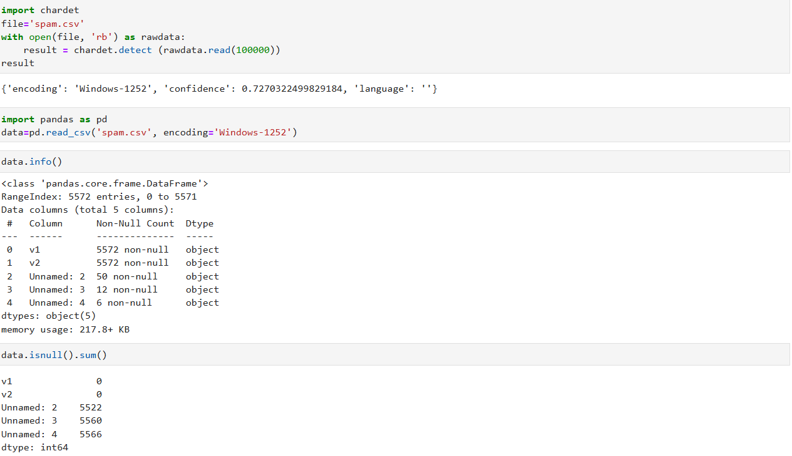

# Implementation-of-SVM-For-Spam-Mail-Detection

## AIM:
To write a program to implement the SVM For Spam Mail Detection.

## Equipments Required:
1. Hardware – PCs
2. Anaconda – Python 3.7 Installation / Jupyter notebook

## Algorithm
1. Start the program, import required libraries (pandas, sklearn, chardet), and detect the encoding format of spam.csv.
2. Load the dataset using pandas and separate the features (message text) and labels (spam/ham).
3. Split the dataset into training and testing sets using train_test_split.
4. Convert the text messages into numerical features using CountVectorizer.
5. Train the Support Vector Machine (SVM) model using the training data.
6. Predict spam/ham for the test data and calculate the model accuracy.
 

## Program:
```

Program to implement the SVM For Spam Mail Detection..
Developed by: N V Chetan Satwik
RegisterNumber:  212224240100
import chardet

file='spam.csv'
with open(file, 'rb') as rawdata:
    result = chardet.detect(rawdata.read(100000))
print(result)

import pandas as pd
data = pd.read_csv('spam.csv', encoding='Windows-1252')

data.info()
print(data.isnull().sum())

x = data["v1"].values
y = data["v2"].values

from sklearn.model_selection import train_test_split
x_train, x_test, y_train, y_test = train_test_split(x, y, test_size=0.2, random_state=0)

from sklearn.feature_extraction.text import CountVectorizer
cv = CountVectorizer()

x_train = cv.fit_transform(x_train)
x_test = cv.transform(x_test)

from sklearn.svm import SVC
svc = SVC()

svc.fit(x_train, y_train)

y_pred = svc.predict(x_test)

print("Predicted values:")
print(y_pred)

from sklearn import metrics
accuracy = metrics.accuracy_score(y_test, y_pred)

print("Accuracy:", accuracy)


```

## Output:





## Result:
Thus the program to implement the SVM For Spam Mail Detection is written and verified using python programming.
